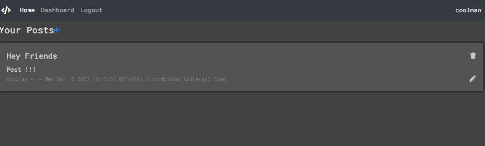

  
  # Tech Deck

  ## Description

  This tech blog is a convenient place for people to post about recent technologies. They can even edit or delete their posts and comment on other people's posts.

  ## Table of Contents

  - [Installation](#installation)
  - [Usage](#usage)
  - [License](#license)
  - [Contributions](#contributions)
  - [Questions](#questions)

  ## Installation

  Just head over to my heroku link! Or if you want to run it on your personal machine, just download it, npm i to install the dependencies, and fill out the .env file with your own sql information.

  ## Usage

  Just sign up, then navigate to your dashboard and hit the plus to add posts! Or click on a post that already exists to leave a comment!
  

  ## License

  This application is covered under the MIT license. Read more at [License: MIT](https://opensource.org/licenses/MIT)

  ## Contributions

  Just email me at sciclunajl@gmail.com with advice or opportunities

  ## Questions

  1. Where can I find your github so that I can view your other projects? https://github.com/scicluna

  2. What email address should I use to contact you regarding further opportunities or questions? sciclunajl@gmail.com
